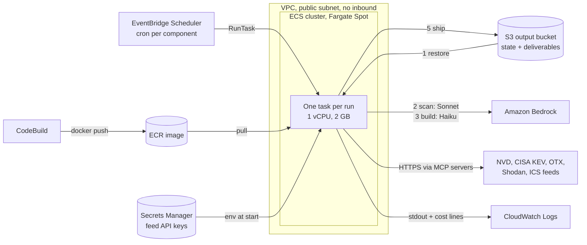

# CTI pipeline on AWS: setup guide

A human readable walkthrough of every AWS piece the pipeline uses, in the order you build
them, with what each one is for, how to create it, and how to check it worked. Use it to
rebuild the POC or to stand the pipeline up for a real job.

- `deploy/aws/deploy-with-claude-code.md` is the runbook Claude Code executes step by step.
  This guide explains the same steps for a person.
- `docs/aws-architecture.html` is the one page diagram (open it in a browser).
- `docs/local-setup.md` runs the same container on your own machine with no AWS at all.

## How a run works



One run, start to finish (`deploy/entrypoint.sh`):

1. **Restore** the component's folder from `s3://<bucket>/<component>/`: dedup log,
   registers, next IDs, earlier deliverables. This is how the pipeline knows what it has
   already reported.
2. **Scan pass**: Claude Code reads `components/<component>/task.md` and does the
   research and analysis on Sonnet, calling the feeds through local MCP servers.
3. **Builder passes** (bulletin scan only): up to two fresh Claude sessions on Haiku turn
   the IDs the scan assigned into documents.
4. **Finalize**: deterministic Python renders reports and rebuilds the state files, so the
   next run deduplicates correctly even if the model forgot to.
5. **Ship** the whole folder back to S3, then the task exits. Nothing runs between runs.

## What it costs (POC, September 2026)

| Service | 30 days | Why |
|---|---|---|
| Bedrock (Claude) | $133.31 | Every model token. This is the bill. |
| ECS Fargate | $3.27 | A few short tasks a week; now on Spot |
| Secrets Manager | $2.11 | About $0.40 per secret per month |
| ECR | $0.42 | Image storage |
| S3 | $0.24 | State and deliverables |

Model choice and run frequency decide the cost; the hosting is noise. Each run prints a
`[cost]` line to CloudWatch, so check those before changing anything else.

---

## Step 0. Decide the basics

| Decision | POC value | For a real job |
|---|---|---|
| AWS account | Personal account `574625227402` | A dedicated account in the organisation's AWS Organization |
| Region | `us-east-1` | Where Bedrock offers the models you need, close to your data |
| Scan model | Sonnet 4.5 (`us.anthropic.claude-sonnet-4-5-20250929-v1:0`) | Same, or newer if your account has it |
| Builder model | Haiku 4.5 (`us.anthropic.claude-haiku-4-5-20251001-v1:0`) | Same |

**Check model access first.** In the Bedrock console (Model access) confirm both models
are available, or run from CloudShell:

```
aws bedrock-runtime converse --region us-east-1 \
  --model-id us.anthropic.claude-haiku-4-5-20251001-v1:0 \
  --messages '[{"role":"user","content":[{"text":"say ok"}]}]' \
  --inference-config '{"maxTokens":5}'
```

A reply containing "ok" means you are set. Run it **once per model, as an admin**
(the root user or a role with `aws-marketplace:Subscribe` and
`aws-marketplace:ViewSubscriptions`): the first call to a model creates the account's
AWS Marketplace subscription for it, and the pipeline's task role is deliberately not
allowed to do that. Until it is done, every call fails with an `AccessDeniedException`
naming those Marketplace actions, and the POC hit exactly this on its first Haiku run.
First time Anthropic use on an account also asks for a short use case form in the Bedrock
console.

## Step 1. Container registry (ECR)

**What:** a private Docker registry named `cti-pipeline` that holds the one image every
component runs. **Why:** Fargate pulls the image from here at the start of each run.

```
aws ecr create-repository --repository-name cti-pipeline --region us-east-1
```

**Check:** the repository appears in the ECR console. Optional: add a lifecycle rule that
keeps the last 10 images so storage does not grow forever.

## Step 2. Build the image (CodeBuild)

**What:** a CodeBuild project that runs `docker build -f deploy/Dockerfile` in AWS and
pushes `cti-pipeline:latest` to ECR. **Why:** nobody needs Docker installed, and the build
is repeatable.

Pieces:
- **Build bucket** `cti-pipeline-build-<account>`, private. Holds `source.zip`, a zip of the
  repo. Make it with `git archive --format=zip -o source.zip HEAD` so it only contains
  committed files (no `.env`, no `out/`).
- **Service role** `cti-pipeline-build`, trusted by `codebuild.amazonaws.com`, allowed to:
  log in and push to the ECR repo, read the build bucket, write CloudWatch logs.
- **Project** `cti-pipeline-build`: source S3 `cti-pipeline-build-<account>/source.zip`,
  image `aws/codebuild/standard:7.0`, small Linux instance, **privileged mode on**
  (required for `docker build`), and a buildspec that does ECR login, build, tag, push.

**Every redeploy:** upload a fresh `source.zip`, then start the build:

```
aws s3 cp source.zip s3://cti-pipeline-build-<account>/source.zip
aws codebuild start-build --project-name cti-pipeline-build
```

**Check:** the build reaches `SUCCEEDED` (about 5 minutes) and ECR shows a new `latest`
push time.

## Step 3. Output bucket (S3)

**What:** `cti-pipeline-out-<account>`, private and versioned. Each component writes to
its own prefix (`bulletin-scan/`, `reporting/` ...). **Why:** the containers are
throwaway, so all memory between runs lives here. Versioning means a bad run can be
rolled back object by object.

```
aws s3api create-bucket --bucket cti-pipeline-out-<account> --region us-east-1
aws s3api put-public-access-block --bucket cti-pipeline-out-<account> \
  --public-access-block-configuration BlockPublicAcls=true,IgnorePublicAcls=true,BlockPublicPolicy=true,RestrictPublicBuckets=true
aws s3api put-bucket-versioning --bucket cti-pipeline-out-<account> \
  --versioning-configuration Status=Enabled
```

**Check:** Block Public Access shows all four settings on.

## Step 4. Secrets (Secrets Manager)

**What:** one secret per feed key: NVD, OTX, Shodan (later Splunk). **Why:** keys never
appear in code, task definitions or logs; ECS injects them as environment variables when
the task starts.

Enter the values yourself in the console (Store a new secret, Other type, plaintext), or
from your own terminal. Never paste a key into a file, a chat, or a commit.

**Check:** note the three ARNs; the task definitions reference them.

## Step 5. IAM roles

Two roles, both trusted by `ecs-tasks.amazonaws.com`. Keeping them separate means the
container itself can never read a secret it was not handed.

**Execution role** `cti-pipeline-exec` (used by ECS to *start* the task):
- AWS managed `AmazonECSTaskExecutionRolePolicy` (pull image, write logs)
- `secretsmanager:GetSecretValue` on the three secret ARNs only

**Task role** `cti-pipeline-task` (used by the code *inside* the task), inline policy
`bedrock-and-s3`:
- `bedrock:InvokeModel` and `bedrock:InvokeModelWithResponseStream` on the Sonnet and
  Haiku inference profiles **and** their foundation models (`us.` profiles route across US
  regions, so the foundation model ARN uses a `*` region)
- `s3:GetObject`, `s3:PutObject` on `cti-pipeline-out-<account>/*`
- `s3:ListBucket` on `cti-pipeline-out-<account>`

**Check:** IAM Policy Simulator, or the smoke test in step 9.

## Step 6. Logs (CloudWatch)

```
aws logs create-log-group --log-group-name /ecs/cti-pipeline
aws logs put-retention-policy --log-group-name /ecs/cti-pipeline --retention-in-days 30
```

**Why:** each run's output, including the `[cost]` lines, lands here under a stream named
after the component. Retention stops logs piling up.

## Step 7. Cluster and task definitions (ECS)

**Cluster** `cti-pipeline`, with Fargate Spot as the default capacity:

```
aws ecs create-cluster --cluster-name cti-pipeline
aws ecs put-cluster-capacity-providers --cluster cti-pipeline \
  --capacity-providers FARGATE FARGATE_SPOT \
  --default-capacity-provider-strategy capacityProvider=FARGATE_SPOT,weight=1
```

Spot is about 70% cheaper. If AWS reclaims a task mid run, that run is lost and the next
scheduled run picks up from the last good state in S3.

**One task definition per component** (`cti-bulletin-scan`, `cti-perimeter-scan`,
`cti-reporting`, `cti-documentation-sync`). All share: Fargate, `awsvpc` networking,
1 vCPU and 2 GB, the two roles, one container `cti` from `cti-pipeline:latest`, logs to
`/ecs/cti-pipeline`. Environment:

| Variable | Value | Purpose |
|---|---|---|
| `COMPONENT` | e.g. `bulletin-scan` | Which `components/<name>/task.md` to run |
| `MODEL_BACKEND` | `bedrock` | Use Bedrock with the task role's credentials |
| `ANTHROPIC_MODEL` | Sonnet profile id (Haiku for documentation-sync) | Main model |
| `BUILD_MODEL` | Haiku profile id | Builder passes |
| `ANTHROPIC_SMALL_FAST_MODEL`, `ANTHROPIC_DEFAULT_HAIKU_MODEL` | Haiku profile id | Claude Code's background calls |
| `CLOUD` | `aws` | Restore from and ship to S3 |
| `OUTPUT_BUCKET` | `cti-pipeline-out-<account>` | Where state lives |
| `AWS_REGION` | `us-east-1` | Bedrock and S3 region |
| `MODE` | `weekly` | Reporting only; the quarterly schedule overrides it |

Secrets (from step 4) per component: bulletin scan and reporting get NVD and OTX;
perimeter scan adds Shodan; documentation sync needs none.

**Check:** the four families show an ACTIVE revision. Schedules that reference a family
without a revision number always run the newest revision.

## Step 8. Network

**POC:** the default VPC, a public subnet, a security group `cti-pipeline-sg` with **no
inbound rules** and all outbound allowed, and `assignPublicIp=ENABLED`. The task only
makes outbound calls (Bedrock, S3, feeds), so nothing can connect in.

## Step 9. Smoke test

Run one task by hand before trusting any schedule:

```
aws ecs run-task --cluster cti-pipeline --task-definition cti-bulletin-scan \
  --capacity-provider-strategy capacityProvider=FARGATE_SPOT,weight=1 \
  --network-configuration "awsvpcConfiguration={subnets=[<subnet>],securityGroups=[<sg>],assignPublicIp=ENABLED}"
aws logs tail /ecs/cti-pipeline --follow
```

**Check:** the log shows the paths resolving, the scan pass, builder passes, `[cost]`
lines, and `done (cloud=aws)`; `aws s3 ls s3://cti-pipeline-out-<account>/bulletin-scan/`
shows new files.

## Step 10. Schedules (EventBridge Scheduler)

A schedule group `cti-pipeline` and a scheduler role (trusted by `scheduler.amazonaws.com`,
allowed `ecs:RunTask` plus `iam:PassRole` on the two task roles; condition the trust on
`aws:SourceAccount` only). One schedule per row, target ECS RunTask with the task
definition, cluster, network config, and capacity provider strategy `FARGATE_SPOT`
(do not also set a launch type; the two cannot be combined):

| Schedule | Task definition | Cron (UTC) | Override |
|---|---|---|---|
| bulletin-scan | cti-bulletin-scan | `cron(0 13 ? * MON,WED,FRI *)` | |
| perimeter-scan | cti-perimeter-scan | `cron(0 13 ? * MON *)` | |
| reporting-weekly | cti-reporting | `cron(0 13 ? * MON *)` | |
| reporting-quarterly | cti-reporting | `cron(0 13 1 1,4,7,10 ? *)` | `MODE=quarterly` |
| documentation-sync | cti-documentation-sync | `cron(0 6 1 * ? *)` | |

Scheduler cron has six fields (with year) and needs `?` in one of the two day fields.
13:00 UTC is 09:00 US Eastern during daylight time.

**Pause and resume:** set a schedule's state to Disabled (console or `update-schedule`).
Everything else stays deployed, and idle costs are a few dollars a month.

---

## For a real job: what to change

The POC is deliberately simple. Before it carries an organisation's work:

**Accounts and access**
- A dedicated AWS account in the organisation's Organization, with SSO users instead of
  long lived personal credentials, and the IAM changes made through infrastructure as code
  (Terraform or CDK) reviewed in pull requests.
- An organisation owned model account: Bedrock, or the Anthropic API under an org
  contract. A personal Max plan token is for one person's own use, not a production job.

**Cost guardrails**
- An **AWS Budget** with alerts at 50%, 80% and 100% of the expected monthly spend.
- A CloudWatch metric filter on the `[cost]` log lines with an alarm per run, so one
  runaway run pages someone instead of surprising the bill.
- Keep `BUILD_PASSES` and the cadences as low as the reporting need allows.

**Network**
- Private subnets with VPC endpoints for S3, ECR, Secrets Manager, CloudWatch Logs and
  Bedrock, and a NAT gateway (or an egress proxy) only for the public feeds. Note a NAT
  gateway costs about $32 a month on its own.

**Reliability**
- A CloudWatch alarm or EventBridge rule on ECS task stopped events with a non zero exit
  code, sent to email or chat.
- Use on demand Fargate (not Spot) for runs that must not be skipped, such as a quarterly
  report due on a date.
- S3 lifecycle rules to move old deliverables to cheaper storage and expire old versions.

**Data and security**
- Encrypt the output bucket with a KMS key you control; restrict who can read it.
- Rotate feed keys on a schedule; give each environment its own secrets.
- Replace the unbranded fallback with the organisation's own document templates, and
  re-check that nothing internal is written into anything marked for wide distribution.

## Tearing it down

In this order, so nothing keeps billing: disable or delete the schedules, delete the task
definitions and the cluster, delete the CodeBuild project and build bucket, empty and
delete the output bucket (download it first if you need the history), delete the secrets
(they bill until deleted), the ECR repository, the log group, and the IAM roles.
